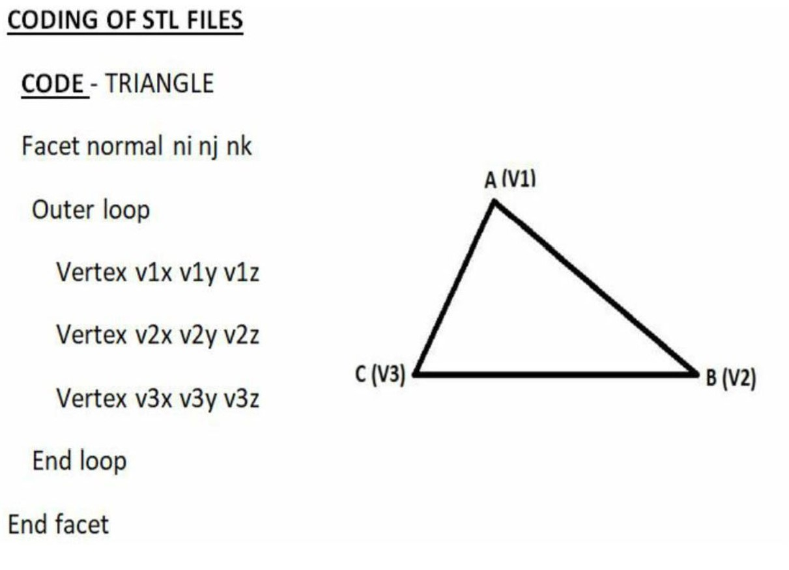
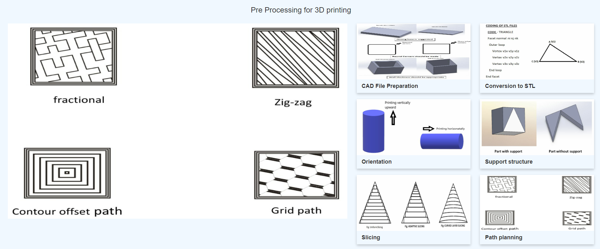

# Ex. No. 7 - SIMULATION OF PRE PROCESSING IN ADDITIVE MANUFACTURING
### DATE: 01-06-2023
## AIM:
### To simulate the Pre Processing for 3D printing.

## REQUIREMENTS:
### System - Windows 7 or higher, 1 GB RAM.

## PROCEDURE:
### Pre-processing encompasses the steps between design and printing. Process of 3D printing starts with designing in CAD. Then printer software slices 3D CAD file into layers. For each slice, the software converts the data into machine code that determines tool paths for the machine to follow. The various steps in pre-processing from design to printing are as follows:

### 1)	CAD File
### 2)	Conversion to STL a. Orientation b. Support Structure c. Slicing d. Path Planning

### 1. CAD File
### Every manufacturing process starts with the process of designing and as in any type of manufacturing, there are certain limitations to the materials and manufacturing processes that dictate how the product should be designed, 3D printing is no different. In 3d printing, characteristics of hardware, software, temperature, filament and many other factors play an important role in how a digital model translates into a printed object. Some of them are designed with a strong base, grain direction, overhung, wall thickness, round corners and tolerances.

### 2. Conversion to STL
### In order to check the interface of the object and make it reliable to 3d printers, conversion to STL file is required. It also facilitates other features like quick error check, bridging the gap between CAD platforms, exhibition purposes and 3D digitizer extension.

### a. Orientation:
### Orientation plays a vital role in the final product of 3d printing as it affects the part accuracy, manufacturing time, strength and surface finish. There are various orientations by which we can print the object such as vertically upward, vertically downward and in horizontal plane.

### b. Support Structure:
### Support structures are required where the objects are unable to get printed directly. Support structures help to guarantee the printability of a section during the 3D printing measure and also it can assist with forestalling part twisting, secure a section to the printing bed and guarantee that parts are joined to the fundamental body of the printed part.

### c. Slicing:
### The motive behind slicing a 3D model is to transform the model into guidelines for the 3D printer. To play out this errand, the slicing software isolates the item into numerous layers. It's classified "slicing" since it "slices" the 3D model to make numerous layers. After the layers have been made, the slicing software applies different qualities to every one of them.

### d. Path Planning:
### Path planning helps to improve the printed surface quality, shape accuracy and infill distribution quality. There are various ways for path planning which can be used to print the objects which may affect the following factors in objects like raster path, grid path, spiral path and zigzag path.

### ●	All the processes related to pre-processing will be shown on the screen.
### ●	Select CAD file preparation from the visible list.
### ●	When the first process is selected then it will open in the blank space in the left side of the screen.
### ●	Select the options of process of pre-processing in the sequence in which they are shown.
### ●	If the user follows an incorrect sequence then a pop-up will appear on the screen showing the name of the process to be selected.

## OUTPUT:

### Step 1:

#### Strong Base:
Adding suitable support structures during pre-processing ensures stability and prevents deformation or collapse during the additive manufacturing process.
#### Rounded Corner:
Intentionally rounding corners reduces stress concentration, improving part strength and reducing the risk of failure during additive manufacturing.
#### Sharp-Edged Corner:
Care must be taken with sharp-edged corners in additive manufacturing, as layer-by-layer printing processes can present challenges, requiring special attention and potentially post-processing techniques for desired sharpness.
#### Wall Thickness:
Optimizing wall thickness is crucial for balancing structural integrity, printability, and efficiency in additive manufacturing, as excessively thin walls may lead to weakness while excessively thick walls can increase print time and cost.

### Step 2:

The code snippet you provided outlines the structure of a triangle in an STL (STereoLithography) file, which is a common file format used for 3D printing. Each triangle represents a facet of the 3D model. Here's a breakdown of the code:

"Facet normal ni nj nk": This line specifies the normal vector of the facet, where "ni," "nj," and "nk" are the x, y, and z components of the normal vector, respectively. The normal vector defines the orientation of the triangle's surface.

"Outer loop": This line indicates the start of the loop that defines the vertices of the triangle.

"Vertex v1x v1y v1z": This line specifies the coordinates of the first vertex of the triangle, where "v1x," "v1y," and "v1z" are the x, y, and z coordinates, respectively.

"Vertex v2x v2y v2z": This line specifies the coordinates of the second vertex of the triangle, similar to the previous line.

"Vertex v3x v3y v3z": This line specifies the coordinates of the third vertex of the triangle, following the same pattern as the previous lines.

"End loop": This line marks the end of the loop that defines the vertices of the triangle.

"End facet": This line signifies the end of the triangle or facet definition.

### Step 3:

#### Printing a cylinder vertically upward in a 3D printer:

Printing a cylinder vertically upward in a 3D printer offers benefits such as increased strength along the vertical axis, smoother vertical surfaces, reduced need for support structures, suitability for tall cylinders, and enhanced performance in vertical load-bearing applications. This orientation aligns layers to maximize strength and achieve a better surface finish, while minimizing the requirement for additional supports.
Printing a cylinder horizontally in a 3D printer:

Printing a cylinder horizontally in a 3D printer allows for improved surface finish on horizontal surfaces, but may require support structures to maintain stability and prevent deformation. This orientation offers versatility for cylinders of varying heights and diameters, making it suitable for a range of applications. However, careful placement and removal of support structures are necessary to ensure print success and maintain the shape of the cylinder. Horizontal printing is beneficial for parts that require strength and durability in horizontal directions, such as tabletops or brackets.

### Step 4:

Printing a part with support structures in 3D printing involves adding additional material to provide stability for overhanging or intricate features, preventing deformations or collapses during the printing process. These supports are designed to be easily removable after printing, but they may leave marks or require post-processing. Conversely, printing a part without support structures is suitable for simple designs or self-supporting geometries, saving time and minimizing the need for post-processing. However, it's crucial to consider print orientation and geometry to ensure successful printing and maintain the desired part quality.

### Step 5:

#### Uniform Slicing:
In uniform slicing, the 3D model is divided into equally spaced layers of consistent thickness, resulting in a regular and predictable printing process.
#### Adaptive Slicing:
Adaptive slicing adjusts the layer thickness dynamically based on the geometry of the model. It allows for variable layer thickness to capture fine details and reduce print time for less complex regions.
#### Curved Layer Slicing:
Curved layer slicing introduces a curved or variable layer thickness, following the contours of the model. It aims to enhance the surface finish and accuracy by aligning the layer boundaries with the shape of the model.
Uniform slicing provides simplicity and consistency, while adaptive slicing offers better efficiency and detail reproduction. Curved layer slicing focuses on improving surface quality by adapting layer thickness to the model's curvature.
The choice of slicing method depends on the specific requirements of the printed part, such as surface finish, print time, and geometric complexity.

### Step 6:

#### Fractonal:
Fractonal slicing divides the layers into smaller sub-layers or fractional layers, allowing for enhanced surface quality and finer details in the printed part.
#### Zig-Zag:
Zig-zag slicing involves printing each layer in a back-and-forth pattern, reducing the need for travel moves and optimizing print time. It is commonly used for infill patterns to maximize efficiency.
#### Contour Offset Path:
Contour offset path slicing involves printing the outer boundary of a layer first and then moving inward, creating a smooth surface finish and minimizing the visibility of layer lines on the outer surface of the part.
#### Grid Path:
Grid path slicing follows a grid-like pattern, where each layer is printed in a back-and-forth motion in one direction, followed by a shift in the perpendicular direction. This method is often used for infill patterns to provide strength and stability to the part.
The choice of slicing method depends on factors such as desired surface finish, print time, strength requirements, and the geometry of the part being printed.

# Output:

### Name: Aravindhnath TR
### Register Number: 212222100005

## Result: 
### Thus the simulation on the Preprocessing in additive manufacturing is completed.
